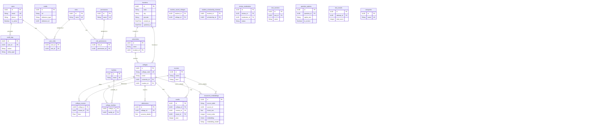

# Padhaanewala Entity-Relationship Diagram

```mermaid
erDiagram
    %% Core System
    locations {
        UUID id PK
        String state
        String city
        String pincode
        DateTime created_at
        DateTime updated_at
    }
    media {
        UUID id PK
        String url
        String reference_type
        UUID reference_id
    }
    audit_logs {
        UUID id PK
        UUID user_id FK
        String action
        String entity_type
    }
    
    %% RAG & Content
    document_embeddings {
        UUID id PK
        String source_table
        UUID source_id
        Text chunk_text
        Integer chunk_index
        Vector embedding
        String embedding_model
    }
    
    %% Users
    users {
        UUID id PK
        String email UK
        String phone UK
        Boolean is_active
    }
    roles {
        UUID id PK
        String name UK
    }
    permissions {
        UUID id PK
        String name UK
    }
    user_roles {
        UUID user_id FK
        UUID role_id FK
    }
    role_permissions {
        UUID role_id FK
        UUID permission_id FK
    }
    
    %% Education
    universities {
        UUID id PK
        String name
        UUID location_id FK
    }
    colleges {
        UUID id PK
        String college_code UK
        String name
        UUID university_id FK
        UUID location_id FK
    }
    courses {
        UUID id PK
        String name
        String level
    }
    college_courses {
        UUID college_id FK
        UUID course_id FK
        Float fees
    }
    facilities {
        UUID id PK
        String name UK
    }
    college_facilities {
        UUID college_id FK
        UUID facility_id FK
    }
    admissions {
        UUID id PK
        UUID college_id FK
        Text process_details
    }
    cutoffs {
        UUID id PK
        UUID college_id FK
        UUID course_id FK
        UUID exam_id FK
        Integer year
    }
    
    %% Relationships
    users ||--o{ audit_logs : generates
    users ||--o{ user_roles : has
    roles ||--o{ user_roles : assigned_to
    roles ||--o{ role_permissions : has
    permissions ||--o{ role_permissions : assigned_to
    
    universities ||--o{ colleges : contains
    locations ||--o{ universities : located_in
    locations ||--o{ colleges : located_in
    colleges ||--o{ college_courses : offers
    courses ||--o{ college_courses : offered_by
    colleges ||--o{ college_facilities : has
    facilities ||--o{ college_facilities : available_at
    colleges ||--o{ admissions : requires
    colleges ||--o{ cutoffs : sets
    courses ||--o{ cutoffs : has
    
    colleges ||--o{ document_embeddings : "source_id/table"
    courses ||--o{ document_embeddings : "source_id/table"
    
    %% Added Normalized Entities
    student_saved_colleges {
        UUID student_id FK
        UUID college_id FK
    }
    student_scholarship_interests {
        UUID student_id FK
        UUID scholarship_id FK
    }
    review_moderation {
        UUID id PK
        UUID review_id FK
        UUID moderator_id FK
        String status
    }
    test_sections {
        UUID id PK
        UUID test_id FK
        String name
    }
    question_options {
        UUID id PK
        UUID question_id FK
        String option_text
        Boolean is_correct
    }
    test_results {
        UUID id PK
        UUID attempt_id FK
        Integer total_score
    }
    categories {
        UUID id PK
        String name UK
    }
    post_categories {
        UUID post_id FK
        UUID category_id FK
    }
    faqs {
        UUID id PK
        String question
        String answer
    }
    banners {
        UUID id PK
        String image_url
    }
    seo_metadata {
        UUID id PK
        String entity_type
        UUID entity_id
    }
    lead_notes {
        UUID id PK
        UUID lead_id FK
        String note
    }
    lead_followups {
        UUID id PK
        UUID lead_id FK
        String scheduled_at
    }
    enquiries {
        UUID id PK
        String name
        String email
    }
```
